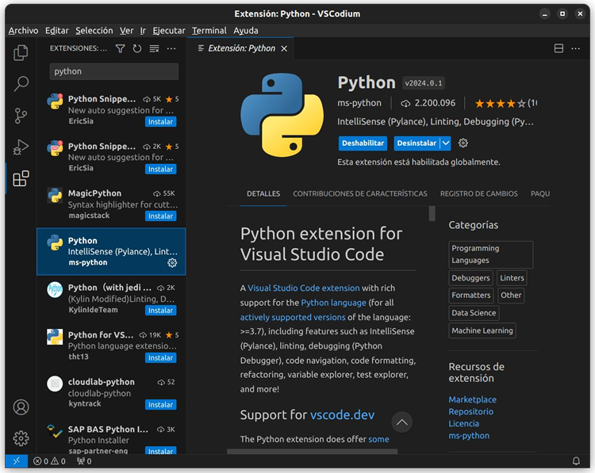
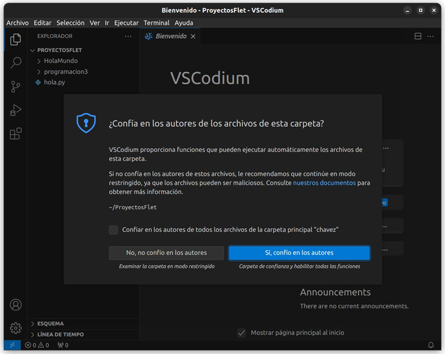

&nbsp;
# 1. Instalación del entorno

Para poder seguir correctamente el tutorial necesitas 2 cosas esenciales: El intérprete de Python y un IDE. A continuación vamos a revisar todo lo necesario para la instalación y puesta a punto de nuestro proyecto.

**Importante**: Todo el software que utilizaremos es software libre, ¡no necesitas gastar un solo peso para tener un entorno de desarrollo de calidad!
\
&nbsp;

## 1.1. ¿Está instalado Python?

Revisa desde la línea de comandos si Python está instalado en tu equipo escribiendo la siguiente instrucción: `python --version` y deberás obtener una salida similar a la siguiente:


Lo que hicimos aquí fue revisar la versión de Python que tenemos instalada. En nuestro caso resultó ser la `3.9.7`, pero seguramente en tu equipo tendrás una versión más actual. En caso de tener algún mensaje negativo puedes descargar el intérprete de Python aquí: https://www.python.org/downloads/.
\
&nbsp;

## 1.2. Entorno Integrado de Desarrollo (IDE)

Un IDE (_Integrated Development Environment_) es esencial para el desarrollo rápido de aplicaciones.

Nosotros te recomendamos usar **VS Codium**, el cual es una alternativa libre al famosísimo VS Code. Puedes descargar VS Codium desde la sección de descargas del portal oficial https://vscodium.com. Recuerda elegir el instalador adecuado para tu plataforma. Al momento de escribir este tutorial, para Güindows te sugerimos utilizar `❏ VSCodiumUserSetup-x64-1.90.0.24158.exe`.

Una vez instalado, te recomendamos intalar el pack en Español. Para ello activa el panel de Extensiones y escribe el nombre del pack:


Y por supuesto, instalar el complemento para ejecutar código Python:



¡Listo! Ya tienes las herramientas necesarias para empezar a programar.
\
&nbsp;

## 2. Configuración del entorno

## 2.1 Directorio de trabajo

El primer paso es crear una carpeta en tu directorio personal o en tu directorio de trabajo habitual. Te recomendamos seguir la convención de nombramiento de NetBeans, Android Studio, PyCharm, y nombrar tu carpeta como `FletProjects` o `ProyectosFlet`:


Ahora abre la carpeta recién creada en VS Codium. Tienes 3 formas:

1. Desde el menú _Archivo_ → _Abrir carpeta_...
1. Con el botón _Abrir carpeta_ del panel Explorador de archivos
1. Arrastrar la carpeta a VS Codium


Antes de que VS Codium abra tu directorio de trabajo, recuerda confiar en tu propio código:



¿Está todo bien? Para saberlo hagamos el universamente infalible "Hola mundo". Crea un nuevo archivo en VS Codium, igual tienen 3 maneras:

1. Desde el menú _Archivo_ → _Nuevo archivo de texto_
1. Clic derecho en el panel Explorador de archivos → _Nuevo archivo_
1. Botón _Nuevo archivo_... en el panel principal

Recuerda agregar la extensión `.py` a cada archivo nuevo que crees.


Escribe el archirequetereconocido código y dale Play:


Si todo sale bien, continúa con la siguiente sección. En caso contrario pide ayuda al profesor de Programación que más confianza le tengas.
\
&nbsp;

## 2.2 Entorno virtual

Aunque este paso no es obligatorio, recomendamos encarecidamente hacerlo. ¿Porqué? Pues porque vamos a instalar varios paquetes de Python que pueden causar conflictos con otros paquetes que instalen en el futuro, por ejemplo con paquetes que utilicen en otras asignaturas.

Para ello, abre una nueva terminal dentro de VS Codium (menú _Terminal_ → _Nuevo terminal_) y ejecuta la siguiente instrucción:

```
python -m venv env-flet
```

De esta manera estamos creando una instalación reducida y aislada de Python, particular para la aplicación que vamos a desarrollar. ¡Esto no significa que no podamos reutilizar este entorno virtual en otros proyectos!

Ahora deberemos configurar VS Codium para que utilice el entorno virtual que recién creamos. Accede al Menú Ver → Paleta de comandos y escribe **Python interpreter** para que te aparezca la siguiente opción:


En la lista desplegable selecciona el entorno virtual `env-flet`.


Ahora solo revisa que el _prompt_ de la terminal muestre el nombre del entorno virtual (en este caso es `env-flet`).
\
&nbsp;

## 3. Instalación de Flet

Desde la terminal de VS Codium instala Flet:

```
pip install flet
```

¿Está todo bien? Para saberlo hagamos el "Hola mundo" en Flet. Para ello podemos reciclar el archivo anterior y escribir el siguiente código:

```python
import flet

def main(page: flet.Page):
    pass

flet.app(target=main)
```

Como resultado debe mostrarse una pequeña ventana vacía como la siguiente:


¡Enhorabuena! Tienes todo listo para comenzar.
\
&nbsp;